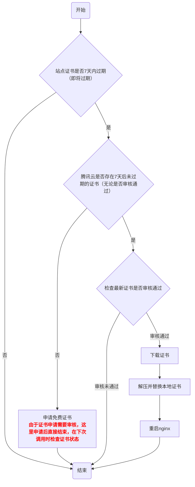

# 一、安装
```shell
# 安装
npm install wmz46/renew-tc-cert
```
# 二、使用
```shell
# 生成配置，会在当前目录生成一个配置文件`renew-tc-cert.yml`
renew-tc-cert init
```
修改配置文件`renew-tc-cert.yml`，配置好域名，配置内容如下
```yaml
# 主域名
DOMAIN:
# 腾讯云SecretId
TENCENTCLOUD_SECRET_ID:
# 腾讯云SecretKey
TENCENTCLOUD_SECRET_KEY:
# 证书存放路径
CERT_PATH:
# nginx所在路径
NGINX_BIN_PATH:
```
# 三、运行
**由于新申请证书需要审核，请使用定时任务定时运行，具体请查看四、程序处理逻辑**
```shell
renew-tc-cert
```
# 四、程序处理逻辑

**由于证书申请需要审核，请使用定时任务调用`renew-tc-cert`，保证证书正常更新**
